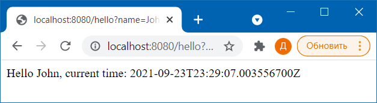

# Тестовое задание

Данный репозиторий является мультимодульным проектом, содержащим 2 простых микросервиса. В качестве основы используются
Spring Boot и Spring Cloud.

Модуль **first** является основным и взаимодействует с пользователем по порту 8080.

Модуль **second** является вспомогательным для модуля **first** и предоставляет метод получения текущего времени 
сервера. Запускается на порту 8081. Считаем, что пользователь не знает о его существовании и не может с ним 
взаимодействовать.

Запуск осуществляется стандартными командами:
```
mvn clean compile
mvn spring-boot:run -pl first
mvn spring-boot:run -pl second
```

Работа с модулем first осуществляется вызовом контроллера приветствия с передачей имени:
```
curl http://localhost:8080/hello?name=John
```

В ответ вернётся соощение формата 
```
Hello {username}, current time: {timestamp}
```

**timestamp** в данном случае будет извлечён из второго микросервиса.

В тестовом задании считаем, что сеть работает идеально и всегда известен адрес микросервиса **second**, поэтому он 
указывается в конфигурации.

## Задача

Требуется модифицировать проект таким образом, чтобы была возможность упаковать оба сервиса в один jar-ник, который 
реализовывал бы весь функционал обоих сервисов и не открывал пользователю лишних методов, таких как получение текущего 
времени из сервиса **second**. Так же требуется сохранить текущую возможность запуска проекта в виде двух микросервисов.

Допускается использование любых дополнительных инструментов и библиотек.


# Выполнение задания
## Внесенные изменения

Проект был модифицирован следующим образом: 
* в корневой pom добавлено два профиля: **microservices** и **monolithic**. Профиль **microservices** запускает оба модуля, профиль
  **monolithic** - только **first**. Мавен-профили связаны с одноименными спринг-профилями.
* в pom модуля first добавлены те же профили. Профиль **microservices** забирает зависимости стека Spring Cloud, остальные 
  зависимости общие. Для того, чтобы не брать зависимость на Feign в монолит-сборку, создан main-класс **Application**.
  <br>Тут столкнулся с проблемой: конфигурация main-класса через профили и плагин не работает, почему-то :-(
  <br>Не смог разобраться, решил это указанием main-класса через параметр запуска.
* в соответсвие с профилем создано два пакета. Над написанными под микросервисы классами навешены аннотации профиля 
  microservices. Дописан **HelloController** без внешних зависимостей, инкапсулирующий метод получения timestamp. (тут для 
  упрощения не стал создавать сервис, и даже приватный метод)
* проперти-файл был разделен на общий, и микросервисный (с указанием порта второго сервиса для Feign). 

## Запуск микросервисного варианта

* пересобрать проект командой консоли с указанием мейн-класса:
```
mvn clean install -Pmicroservices -DskipTests -Dstart-class=com.example.first.FirstApplication
```
* поднять микросервисы (первый - с явным указанием мейн-класса):
```
mvn spring-boot:run -pl first -Pmicroservices -Dstart-class=com.example.first.FirstApplication
mvn spring-boot:run -pl second
```

## Запуск монолитного варианта

* пересобрать проект командой консоли с указанием мейн-класса:
```
mvn clean install -Pmonolithic -DskipTests -Dstart-class=com.example.first.Application
```
* поднять первый сервис (с явным указанием мейн-класса):
```
mvn spring-boot:run -pl first -Pmonolithic -Dstart-class=com.example.first.Application
```

## Результаты

Как и ожидалось, оба варианта отработали корректно
